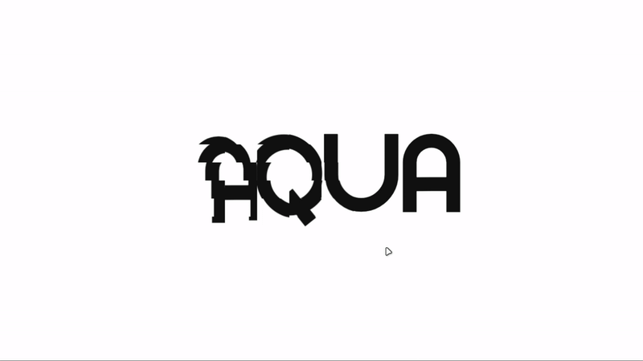

# Gridy Shader Effect

A captivating Grid Shader Effect that delivers an immersive and interactive experience with fluid animations and dynamic visuals.

Initially, I discovered this captivating grid shader effect online and took on the challenge to learn how to create it. With the help of ChatGPT and my self-learning capabilities, I successfully nailed it! It took me 3 days, dedicating about 2 hours each day to master the effect.

Preview 

# 💻 Tech Stack:
    

## About
This project showcases a visually stunning grid shader effect, designed to enhance user interaction through smooth animations and transitions. Utilizing advanced libraries such as GSAP for seamless motion and Lenis for optimal scrolling performance, it exemplifies the integration of cutting-edge web technologies to create a captivating user experience. 🚀
